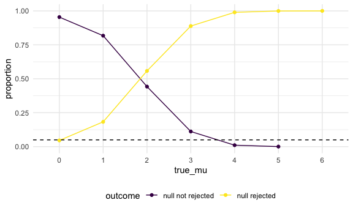

Homework 5
================
Murrel Pereira
11/10/2020

## Problem 1

Read in the data.

``` r
homicide_df =
  read_csv("homicide_data/homicide-data.csv") %>% 
  janitor::clean_names() %>% 
  mutate(
    resolved = case_when(
      disposition == "Closed without arrest" ~ "unsolved",
      disposition == "Open/No arrest"        ~ "unsolved",
      disposition == "Closed by arrest"      ~ "solved"
    ),
    city_state = str_c(city, state, sep = "_")
  ) %>% 
  select(city_state, resolved) %>% 
  filter(city_state != "Tulsa_AL") 
```

    ## Parsed with column specification:
    ## cols(
    ##   uid = col_character(),
    ##   reported_date = col_double(),
    ##   victim_last = col_character(),
    ##   victim_first = col_character(),
    ##   victim_race = col_character(),
    ##   victim_age = col_character(),
    ##   victim_sex = col_character(),
    ##   city = col_character(),
    ##   state = col_character(),
    ##   lat = col_double(),
    ##   lon = col_double(),
    ##   disposition = col_character()
    ## )

Look at this a bit

``` r
aggregate_df =
homicide_df %>% 
  group_by(city_state) %>% 
  summarize(
    hom_total = n(),
    hom_unsolved = sum(resolved == "unsolved")
  ) %>% 
  arrange(hom_unsolved)
```

    ## `summarise()` ungrouping output (override with `.groups` argument)

Can I do a prop test for a single city?

``` r
prop.test(
  aggregate_df %>% filter(city_state == "Baltimore_MD") %>% pull(hom_unsolved),
  aggregate_df %>% filter(city_state == "Baltimore_MD") %>% pull(hom_total)
) %>% 
  broom::tidy()
```

    ## # A tibble: 1 x 8
    ##   estimate statistic  p.value parameter conf.low conf.high method    alternative
    ##      <dbl>     <dbl>    <dbl>     <int>    <dbl>     <dbl> <chr>     <chr>      
    ## 1    0.646      239. 6.46e-54         1    0.628     0.663 1-sample… two.sided

Try to iterate….

``` r
results_df =
aggregate_df %>% 
  mutate(
    prop_tests = map2(.x = hom_unsolved, .y = hom_total, ~prop.test(x = .x, n = .y)),
    tidy_tests = map(.x=prop_tests, ~broom::tidy(.x))
  ) %>% select(-prop_tests) %>% 
  unnest(tidy_tests) %>% 
  select(city_state, estimate, conf.low, conf.high) %>% 
  arrange(desc(estimate))
```

``` r
results_df %>% 
  mutate(city_state = fct_reorder(city_state, estimate)) %>% 
  ggplot(aes(x = city_state, y = estimate)) +
  geom_point() +
  geom_errorbar(aes(ymin = conf.low, ymax = conf.high)) +
  theme(axis.text.x = element_text(angle = 90, vjust = 1, hjust = 1))
```


## Problem 2

Create tidy dataset

``` r
path_df = 
tibble(
  path = list.files("lda_data")
) %>% 
  mutate(
    path = str_c("lda_data/",path),
    obs = map(path, read_csv),
    treatment = case_when(
      str_detect(path, "con") ~ "control",
      str_detect(path, "exp") ~ "experimental"
    ),
    subject = substr(path, start = 10, stop =15),
    subject = as.factor(subject),
    treatment = as.factor(treatment)
  ) %>% 
  unnest(obs) %>% 
  pivot_longer(week_1:week_8,
              names_to ="week",
              names_prefix = "week_",
              values_to = "observations")
```

    ## Parsed with column specification:
    ## cols(
    ##   week_1 = col_double(),
    ##   week_2 = col_double(),
    ##   week_3 = col_double(),
    ##   week_4 = col_double(),
    ##   week_5 = col_double(),
    ##   week_6 = col_double(),
    ##   week_7 = col_double(),
    ##   week_8 = col_double()
    ## )
    ## Parsed with column specification:
    ## cols(
    ##   week_1 = col_double(),
    ##   week_2 = col_double(),
    ##   week_3 = col_double(),
    ##   week_4 = col_double(),
    ##   week_5 = col_double(),
    ##   week_6 = col_double(),
    ##   week_7 = col_double(),
    ##   week_8 = col_double()
    ## )
    ## Parsed with column specification:
    ## cols(
    ##   week_1 = col_double(),
    ##   week_2 = col_double(),
    ##   week_3 = col_double(),
    ##   week_4 = col_double(),
    ##   week_5 = col_double(),
    ##   week_6 = col_double(),
    ##   week_7 = col_double(),
    ##   week_8 = col_double()
    ## )
    ## Parsed with column specification:
    ## cols(
    ##   week_1 = col_double(),
    ##   week_2 = col_double(),
    ##   week_3 = col_double(),
    ##   week_4 = col_double(),
    ##   week_5 = col_double(),
    ##   week_6 = col_double(),
    ##   week_7 = col_double(),
    ##   week_8 = col_double()
    ## )
    ## Parsed with column specification:
    ## cols(
    ##   week_1 = col_double(),
    ##   week_2 = col_double(),
    ##   week_3 = col_double(),
    ##   week_4 = col_double(),
    ##   week_5 = col_double(),
    ##   week_6 = col_double(),
    ##   week_7 = col_double(),
    ##   week_8 = col_double()
    ## )
    ## Parsed with column specification:
    ## cols(
    ##   week_1 = col_double(),
    ##   week_2 = col_double(),
    ##   week_3 = col_double(),
    ##   week_4 = col_double(),
    ##   week_5 = col_double(),
    ##   week_6 = col_double(),
    ##   week_7 = col_double(),
    ##   week_8 = col_double()
    ## )
    ## Parsed with column specification:
    ## cols(
    ##   week_1 = col_double(),
    ##   week_2 = col_double(),
    ##   week_3 = col_double(),
    ##   week_4 = col_double(),
    ##   week_5 = col_double(),
    ##   week_6 = col_double(),
    ##   week_7 = col_double(),
    ##   week_8 = col_double()
    ## )
    ## Parsed with column specification:
    ## cols(
    ##   week_1 = col_double(),
    ##   week_2 = col_double(),
    ##   week_3 = col_double(),
    ##   week_4 = col_double(),
    ##   week_5 = col_double(),
    ##   week_6 = col_double(),
    ##   week_7 = col_double(),
    ##   week_8 = col_double()
    ## )
    ## Parsed with column specification:
    ## cols(
    ##   week_1 = col_double(),
    ##   week_2 = col_double(),
    ##   week_3 = col_double(),
    ##   week_4 = col_double(),
    ##   week_5 = col_double(),
    ##   week_6 = col_double(),
    ##   week_7 = col_double(),
    ##   week_8 = col_double()
    ## )
    ## Parsed with column specification:
    ## cols(
    ##   week_1 = col_double(),
    ##   week_2 = col_double(),
    ##   week_3 = col_double(),
    ##   week_4 = col_double(),
    ##   week_5 = col_double(),
    ##   week_6 = col_double(),
    ##   week_7 = col_double(),
    ##   week_8 = col_double()
    ## )
    ## Parsed with column specification:
    ## cols(
    ##   week_1 = col_double(),
    ##   week_2 = col_double(),
    ##   week_3 = col_double(),
    ##   week_4 = col_double(),
    ##   week_5 = col_double(),
    ##   week_6 = col_double(),
    ##   week_7 = col_double(),
    ##   week_8 = col_double()
    ## )
    ## Parsed with column specification:
    ## cols(
    ##   week_1 = col_double(),
    ##   week_2 = col_double(),
    ##   week_3 = col_double(),
    ##   week_4 = col_double(),
    ##   week_5 = col_double(),
    ##   week_6 = col_double(),
    ##   week_7 = col_double(),
    ##   week_8 = col_double()
    ## )
    ## Parsed with column specification:
    ## cols(
    ##   week_1 = col_double(),
    ##   week_2 = col_double(),
    ##   week_3 = col_double(),
    ##   week_4 = col_double(),
    ##   week_5 = col_double(),
    ##   week_6 = col_double(),
    ##   week_7 = col_double(),
    ##   week_8 = col_double()
    ## )
    ## Parsed with column specification:
    ## cols(
    ##   week_1 = col_double(),
    ##   week_2 = col_double(),
    ##   week_3 = col_double(),
    ##   week_4 = col_double(),
    ##   week_5 = col_double(),
    ##   week_6 = col_double(),
    ##   week_7 = col_double(),
    ##   week_8 = col_double()
    ## )
    ## Parsed with column specification:
    ## cols(
    ##   week_1 = col_double(),
    ##   week_2 = col_double(),
    ##   week_3 = col_double(),
    ##   week_4 = col_double(),
    ##   week_5 = col_double(),
    ##   week_6 = col_double(),
    ##   week_7 = col_double(),
    ##   week_8 = col_double()
    ## )
    ## Parsed with column specification:
    ## cols(
    ##   week_1 = col_double(),
    ##   week_2 = col_double(),
    ##   week_3 = col_double(),
    ##   week_4 = col_double(),
    ##   week_5 = col_double(),
    ##   week_6 = col_double(),
    ##   week_7 = col_double(),
    ##   week_8 = col_double()
    ## )
    ## Parsed with column specification:
    ## cols(
    ##   week_1 = col_double(),
    ##   week_2 = col_double(),
    ##   week_3 = col_double(),
    ##   week_4 = col_double(),
    ##   week_5 = col_double(),
    ##   week_6 = col_double(),
    ##   week_7 = col_double(),
    ##   week_8 = col_double()
    ## )
    ## Parsed with column specification:
    ## cols(
    ##   week_1 = col_double(),
    ##   week_2 = col_double(),
    ##   week_3 = col_double(),
    ##   week_4 = col_double(),
    ##   week_5 = col_double(),
    ##   week_6 = col_double(),
    ##   week_7 = col_double(),
    ##   week_8 = col_double()
    ## )
    ## Parsed with column specification:
    ## cols(
    ##   week_1 = col_double(),
    ##   week_2 = col_double(),
    ##   week_3 = col_double(),
    ##   week_4 = col_double(),
    ##   week_5 = col_double(),
    ##   week_6 = col_double(),
    ##   week_7 = col_double(),
    ##   week_8 = col_double()
    ## )
    ## Parsed with column specification:
    ## cols(
    ##   week_1 = col_double(),
    ##   week_2 = col_double(),
    ##   week_3 = col_double(),
    ##   week_4 = col_double(),
    ##   week_5 = col_double(),
    ##   week_6 = col_double(),
    ##   week_7 = col_double(),
    ##   week_8 = col_double()
    ## )

Create spaghetti
plot

``` r
ggplot(path_df, aes(x = week, y = observations, group = subject, color = treatment)) + geom_point() + geom_line() + 
  labs(title = "Observations over time",x = "Week", y= "Observations"
  )
```


You can see that the observations for the control group do not change
over the 8 week period but in contrast, the observations for the
experimental treatment group increase over time.

## Problem 3

Create function

``` r
sim_t_test = function(mu = 1) {
  
  sim_data = tibble(
    x = rnorm(30, mean = mu, sd = 5),
  )
  
  sim_data %>% 
    t.test(mu = 0, alpha = .05) %>% 
    broom::tidy() %>% 
    select(estimate, p.value) 

}
```

Iterate function and save results

``` r
sim_results =
  tibble(true_mu = c(0:6)) %>% 
  mutate(
    output_lists = map(.x = true_mu, ~rerun(5000, sim_t_test(mu = .x))),
    t_test_dfs = map(output_lists, bind_rows)
  ) %>% 
  select(-output_lists) %>% 
  unnest(t_test_dfs) %>% 
  mutate(
    outcome = case_when(
      p.value <= 0.05 ~ "null rejected",
      p.value > 0.05  ~ "null not rejected"
    ),
    true_mu = as.factor(true_mu)
  )
```

``` r
sim_results_summary = 
  sim_results %>% 
  group_by(true_mu, outcome) %>% 
  summarize(n = n(), proportion = n/5000)
```

    ## `summarise()` regrouping output by 'true_mu' (override with `.groups` argument)

An exploratory
plot:

``` r
ggplot(sim_results, aes(x= true_mu, y = p.value, color = true_mu)) + geom_boxplot() + geom_hline(yintercept = 0.05, linetype = "dashed")
```


\#\#\#\#Power of the
test

``` r
ggplot(sim_results_summary, aes(x = true_mu, y = proportion, color = outcome, group = outcome)) + geom_point() + geom_line() + geom_hline(yintercept = 0.05, linetype = "dashed")
```



You can see in the above graph that the null is more likely to be
rejected the further true\_mu is away from 0 and the null is less likely
to be rejected the closer true\_mu is to 0. The power of the t-test to
reject the null that mu\_hat is 0 is igher the further away from 0 the
mean
is.

#### Estimate vs true mu

``` r
ggplot(sim_results, aes(x = true_mu, y = estimate)) + geom_violin() + geom_violin(aes(x = true_mu, y = estimate, fill = outcome, color = outcome))
```


From the above plot, you can see that the simulated data has a similar
standard deviation across each true\_mu population and the estimate
changes with true\_mu. When you look at the spread of the data that
rejects the null vs did not reject the null, you can see that when
true\_mu is 4 or less, the estimate for the the population for null not
rejected is usually lower than the full population estimate. On the
other hand, for the samples where the null is rejected, you can see that
the estimate is higher than the full set of samples.
